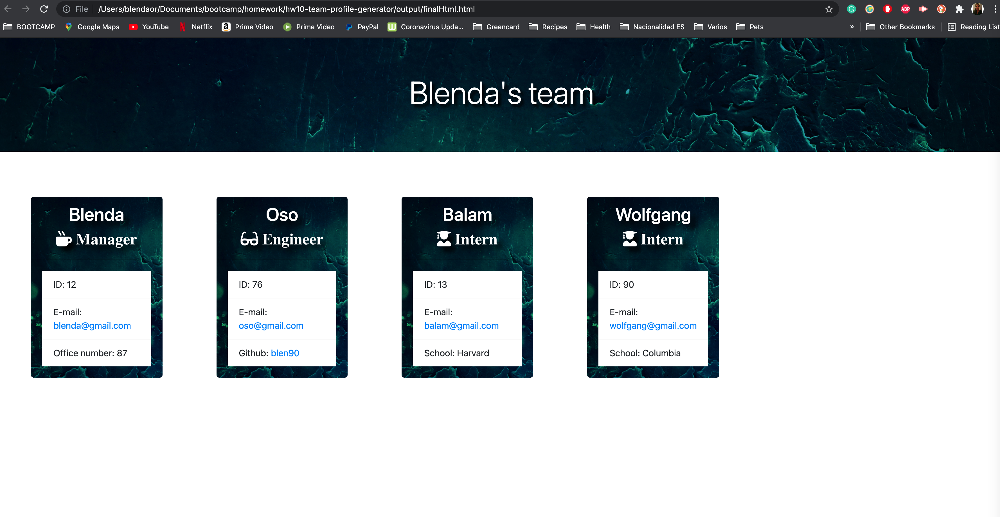
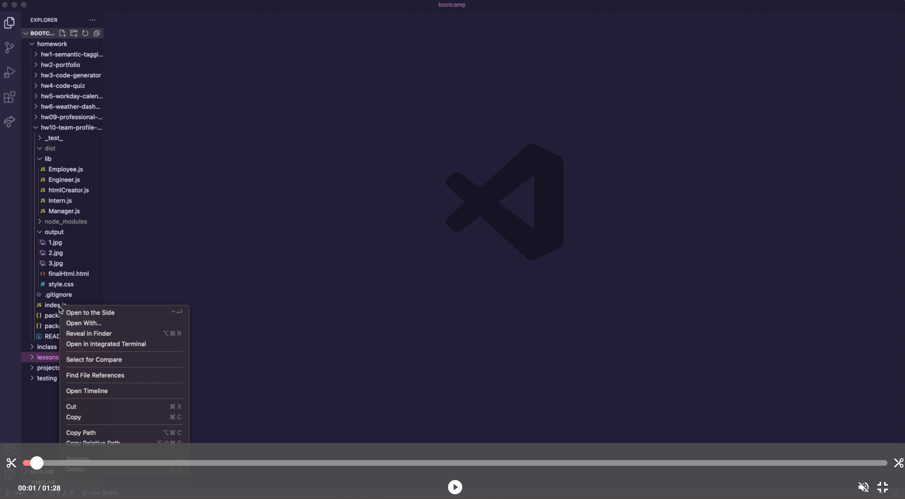
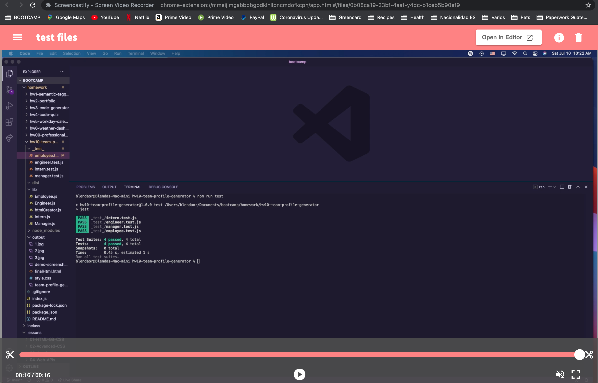

# Team Profile Generator

[]()

# Description

This app is a Team Profile Generator. It allows the user to add new team members such as manager, engineer or intern and creates an HTML file once the team is complete. Once the HTML file is generated the user can send an email to the email address that was added to each employee or be redirected to the engineer's GitHub profile. 

## Screenshot of the app



## Demo of the app

(Click on the image below to be redirected to the Youtube demo video)

[](https://www.youtube.com/watch?v=kt0x8Xmc4Dk)

## Test demo

(Click on the image below to be redirected to the Youtube demo video)

[](https://www.youtube.com/watch?v=6FcOg1TgJRc)

# Table of Contents

* [Installation](#installation)
    
* [Usage](#usage)

* [Technology](#technology)

* [License](#license)

* [Contributors](#contributors)

* [Questions](#questions)

# Installation

Download the repo and then run  the following command in the terminal at the root of the folder:

```
node index.js
```

To run the test you will need to add the following command to the terminal

```
npm run test
```

# Usage

Once the user runs ```node index.js``` in the comman line they will be prompted with a few questions. Once the user has filled out the information an HTML file will be generated and it can be viewed in the browser. The links are functional for email and to be redirected to GitHub. 

The finalHtml file gets added to the output folder and shows up as the following:

```
./output/finalHtml.html
```

# Technology

* Inquirer
* NodeJs

# License 

This project is governed by: MIT License

# Contributors

Blenda Orellana

# Questions

If you have any questions about the repo or the app please feel free to contact me
 * Email: blen.or90@gmail.com
 * Github: https://github.com/blen90
